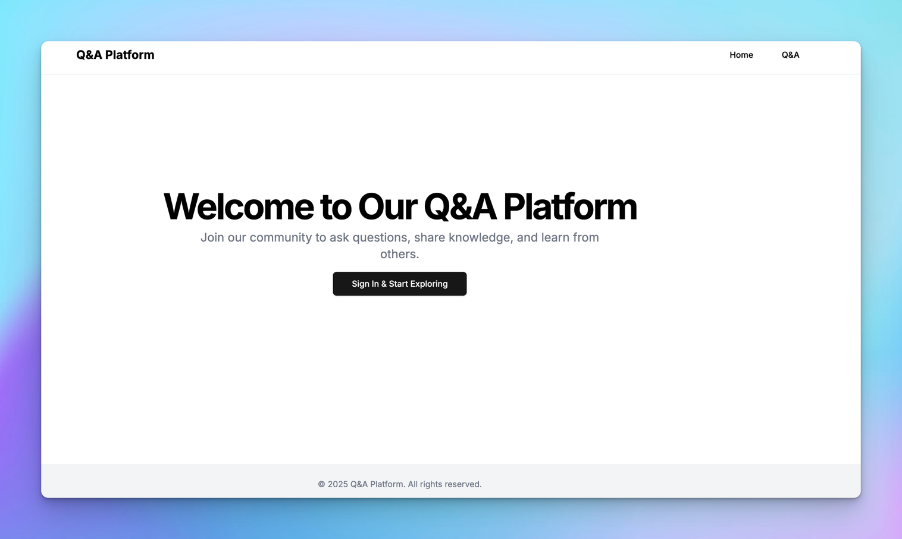

# Q&A Platform with RBAC

> A modern Q&A platform built with Next.js and Clerk, featuring role-based access control. Ask questions, share knowledge, and learn from others in a secure, well-structured environment.



## 🌟 Features

- **Authentication & Authorization**
  - Secure authentication with Clerk
  - Role-based access control (RBAC)
  - Protected routes and API endpoints

- **Core Functionality**
  - Ask and answer questions
  - Search users and questions
  - Admin dashboard for content moderation
  - Real-time updates

## 🚀 Getting Started

### Prerequisites

- Node.js 18+
- npm/yarn
- A Clerk account
- A Neon Database account

### Installation

1. Clone the repository:
```bash
git clone https://github.com/tyaga001/clerk-qa-platform
cd clerk-qa-platform
```

2. Install dependencies:
```bash
npm install
```

3. Set up environment variables:
```bash
# Create a .env file in the root directory and add:
NEXT_PUBLIC_CLERK_PUBLISHABLE_KEY=your_publishable_key
CLERK_SECRET_KEY=your_secret_key
NEON_DATABASE_URL=your_database_url
```

4. Initialize the database:
```bash
npx drizzle-kit push
```

5. Start the development server:
```bash
npm run dev
```

Visit `http://localhost:3000` to see the application.

## 🏗️ Project Structure

```
clerk-qa-platform/
├── .idea/                # IDE configuration
├── .next/                # Next.js build output
├── drizzle/              # Drizzle ORM files
├── node_modules/         # Dependencies
├── public/              # Static files
├── src/                 # Source code
│   ├── app/            # Next.js app directory
│   │   ├── admin/      # Admin dashboard
│   │   ├── api/        # API routes
│   │   ├── qa/         # Q&A features
│   │   └── searchUsers/# User search functionality
│   ├── components/     # React components
│   ├── db/            # Database configurations
│   ├── lib/           # Utility libraries
│   ├── types/         # TypeScript types
│   └── utils/         # Utility functions
├── .env               # Environment variables
├── .gitignore        # Git ignore rules
├── favicon.ico       # Site favicon
├── globals.css       # Global styles
├── layout.tsx        # Root layout
├── middleware.ts     # Auth middleware
└── page.tsx          # Root page
```

## 🔐 Role-Based Access Control

The platform implements three main roles:
- **Admin**: Full access to all features
- **Moderator**: Can moderate content
- **User**: Can ask and answer questions

## 📝 Environment Variables

Required environment variables:
```bash
NEXT_PUBLIC_CLERK_PUBLISHABLE_KEY=
CLERK_SECRET_KEY=
NEON_DATABASE_URL=
```

## 🤝 Contributing

Contributions are welcome. Please feel free to submit a Pull Request.

1. Fork the repository
2. Create your feature branch (`git checkout -b feature/AmazingFeature`)
3. Commit your changes (`git commit -m 'Add some AmazingFeature'`)
4. Push to the branch (`git push origin feature/AmazingFeature`)
5. Open a Pull Request

## 📄 License

This project is licensed under the Creative Commons License - see the [LICENSE](LICENSE) file for details.

## 👏 Acknowledgments

- [Clerk](https://clerk.dev/) for authentication
- [Neon](https://neon.tech/) for the database